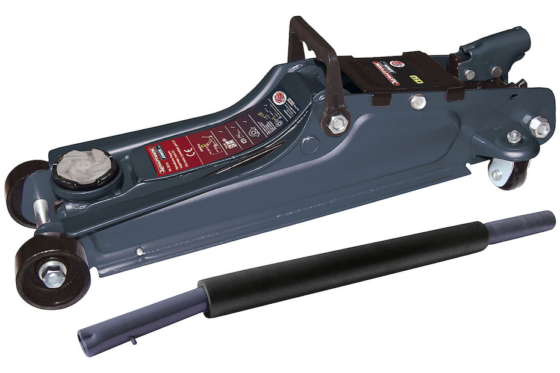
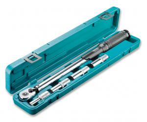
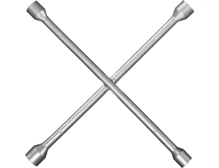

# Auto-Radwechsel

```admonish info title="Wer kennt sich hier aus?"
Danilo, Jessy, Remo
```

Im Lager liegen ein hydraulischer Wagenheber, ein Radkreuz sowie ein
Drehmomentschlüssel, so dass du deinen saisonalen Radwechsel problemlos
im Coredump (bzw bitte in der Tiefgarage 🙃) durchführen kannst.






