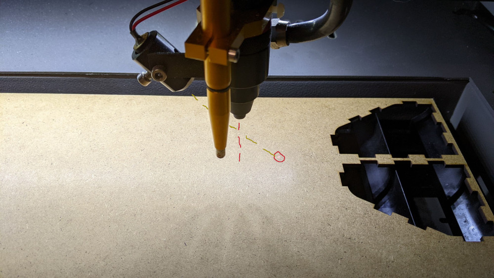
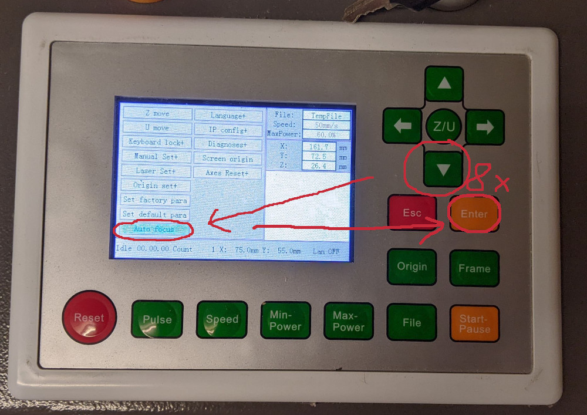
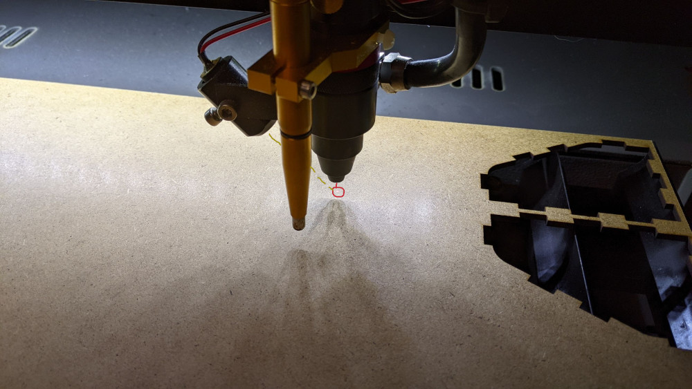

# Lasercutter

```admonish info title="Wer kennt sich hier aus?"
Danilo, Till
```

```admonish warning title="Einweisung notwendig"
Für die Verwendung des Lasercutters ist eine Einweisung notwendig. Wende dich an Danilo.
```

Inhalt:

<!-- toc -->

## Lasercutter

User Laser ist ein Gweke LC6090 mit einer 80W-CO2-Laserröhre. Das Gerät
verfügt über einen Ruida-Controller und eine Arbeitsfläche von 60x90 cm.
Das Bett ist in Z-Richtung verstellbar.

Die (potentiell giftigen) Dämpfe werden mithilfe einer Lüftung nach
draussen geblasen. Die Laserröhre wird mit einer aktiven Wasserkühlung
gekühlt.

Ein Luftkompressor sorgt für "Air Assist" am Laserkopf. Zudem haben wir
eine Autofokus-Vorrichtung sowie einen "Red Dot".

## Kosten / Benutzung

Die Benutzung des Lasers kostet 5 CHF pro angefangene Viertelstunde.

Die Zeit beginnt zu dem Zeitpunkt, wo man den Lasercutter einschaltet,
und endet, wenn man ihn wieder ausschaltet.

Der Lasercutter darf nur von Coredump-Mitgliedern mit vorgängiger
Einweisung benutzt werden.

## Software

Zum Erstellen von Cut-Files für den Laser kann grundsätzlich jede
Software verwendet werden, die Vektor-Dateien (SVG, DXF, ...) erstellen
kann. Zum Beispiel:

- [Inkscape](https://inkscape.org/)
- Adobe Illustrator

Siehe auch "Inkscape-Tipps" weiter unten.

Auf dem Laser-PC selbst wird dann
[Lightburn](https://lightburnsoftware.com/) zur Steuerung verwendet.

## Files auf Laser-PC übertragen

Dateien können entweder via USB-Stick oder via Webdropper-Tool auf den Laser-PC transferiert werden.

**USB-Stick**

Dieser sollte sich direkt beim Laser-PC befinden. Benutzung muss hier wohl nicht erklärt werden 😉

**Webdropper**

Aus dem internen Netz kann via <http://10.0.0.15/> oder <http://laser/>
auf das [Webdropper-Tool](https://github.com/coredump-ch/webdropper)
zugegriffen werden. Die Files können per Drag&Drop hochgeladen werden
und landen dann unter `~/Webdroper/` auf dem Laser-PC.

Vom Terminal kann mittels HTTPie folgendermassen hochgeladen werden:
`http --form http://10.0.0.15/ file@$filename`

## Z-Achse Fokussieren (Autofokus)

Bevor man mit einem neuen Material arbeitet, muss man immer die Höhe des
Z-Betts ausrichten, damit der Laser auf die Materialoberfläche
fokussiert ist.

Wenn der Laser nicht korrekt fokussiert ist, zeigt auch der Laserpointer
an den falschen Ort:



Bei diesem Bild sieht man, dass der Fokuspunkt des Lasers weiter oben
wäre. Damit man den Abstand nicht manuell einstellen muss, haben wir
einen Autofokus (dieser gelbe Stift vorne). Um diesen zu benutzen,
**muss zuerst sichergestellt werden dass sich der gelbe Stift über dem
Material befindet, und nicht etwa über einem Loch, sonst kann es zu
Beschädigungen des Lasers kommen!**

Danach auf der Steuerung die Taste Z/U drücken um das Menu zu öffnen.


Nun muss die Runter-Taste so oft gedrückt werden, bis "Auto focus"
ausgewählt ist. Dann mit der "Enter"-Taste bestätigen...



...und der Laser sollte sich selbständig fokussieren. Resultat:



## Einführungskurs

Slides: [laser-einführung-2021-09-13.pdf](./laser/laser-einführung-2021-09-13.pdf)

Source: <https://git.coredump.ch/space/laser-intro>

## Tipps und Tricks

### Sperrholz biegbar machen

<https://www.thingiverse.com/thing:12707>

### Inkscape-Tipps

[Inkscape](https://inkscape.org/) eignet sich wunderbar um SVG-Files für
den Lasercutter vorzubereiten. Hier einige Hinweise:

- Lightburn unterscheidet nicht via Layer sondern via Farben zwischen
  unterschiedlichen Cuts. Am besten in Inkscape trotzdem Layer
  verwenden, aber diese noch separat einfärben. z.B.
  - Rot für Cut
  - Dunkelblau für Flächen (Text)
  - Schwarz für Linien
- Für repetitive Sachen kann Inkscape auch gescripted werden. Siehe
  <https://wiki.inkscape.org/wiki/index.php/Using_the_Command_Line>
