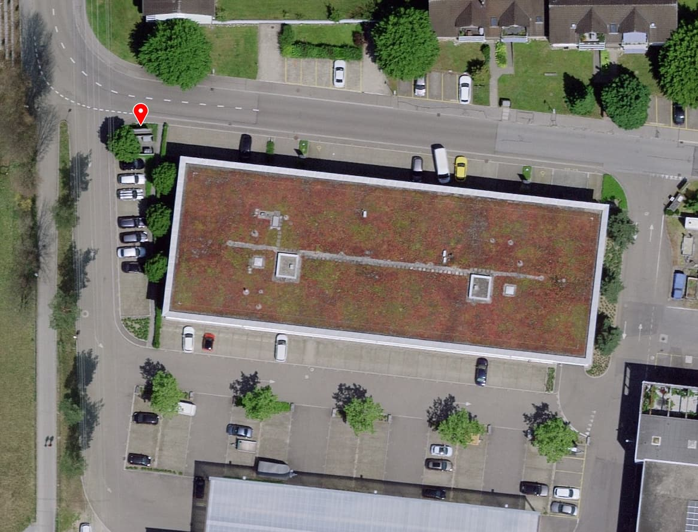

# Entsorgung

Vorneweg: Wir haben kein Reinigungspersonal. Das heisst, **wir sind
darauf angewiesen, dass alle Raumbenützer beim Entsorgen mithelfen**.
Wenn der Abfallsack voll ist, bitte entsorgen! Genauso beim Glas/Alu:
Bitte mithelfen, damit nicht immer die gleichen Personen den Abfall
mitnehmen müssen. Danke für die Mithilfe!

## Regulärer Abfall

Der Reguläre Müll kann mit Gebührensäcken in den Containern entsorgt
werden. Der Container steht hier:

## Sammelstellen Glas / Alu / PET / etc

- Glas: [Rütiwies-/Porthofstrasse](https://www.rapperswil-jona.ch/abfallorte/1979)
- Glas, Alu, Blech: [Tüchiparkplatz](https://www.rapperswil-jona.ch/abfallorte/1974)
- PET: [Migros Jona](https://www.openstreetmap.org/?mlat=47.23174&mlon=8.83697#map=19/47.23133/8.83729)
- PET: [Coop Tüchi](https://www.openstreetmap.org/?mlat=47.22732&mlon=8.82204#map=19/47.22732/8.82204)
- Alles: [Entsorgungspark Engelhölzli](http://www.rueegg-jona.ch/entsorgungspark/)
