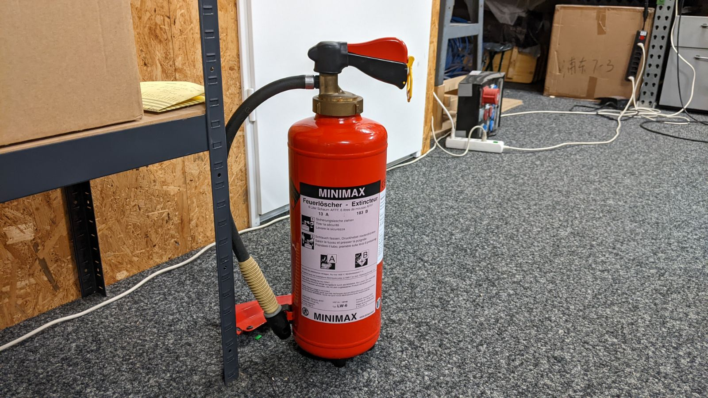
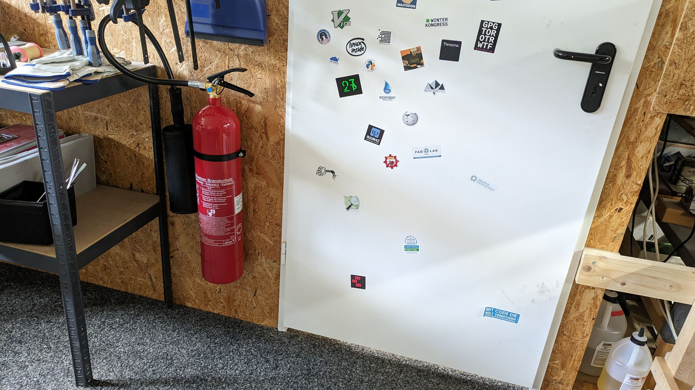

# Feuerlöscher

## Schaum-Löscher 6L (beim Eingang)

_Leistungsklassen: 13A 183B_

Neben dem Haupt-Eingang befindet sich ein Schaum-Feuerlöscher von Minimax.
Dieser Allround-Löscher ist für den allgemeinen Gebrauch vorgesehen (jedoch
_nicht_ für elektrische Geräte wie den Lasercutter, siehe weiter unten).



## CO2-Löscher 5kg (neben Türe Holzraum)

_Leistungsklassen: 89B_

Leider beschädigt der Lösch-Schaum elektrische Geräte. Falls es in einem solchen
Gerät brennen sollte (z.B. im Lasercutter), sollte daher der CO2-Löscher
bevorzugt werden. Dieser befindet sich in Nähe des Lasercutters, neben der Türe
zum Holzraum.



Video mit einigen Hinweisen: <https://www.youtube.com/watch?v=LFwtD1ki5bM>

```admonish warning title="Achtung"
Das CO2 verdrängt Sauerstoff, deshalb sollte nach Benutzung des CO2-Löschers
(wenn das Feuer gelöscht wurde) umbedingt sofort gelüftet werden.

Zudem ist das austretende CO2 extrem kalt, deshalb sollten Personen nicht
mit CO2 gelöscht werden!
```