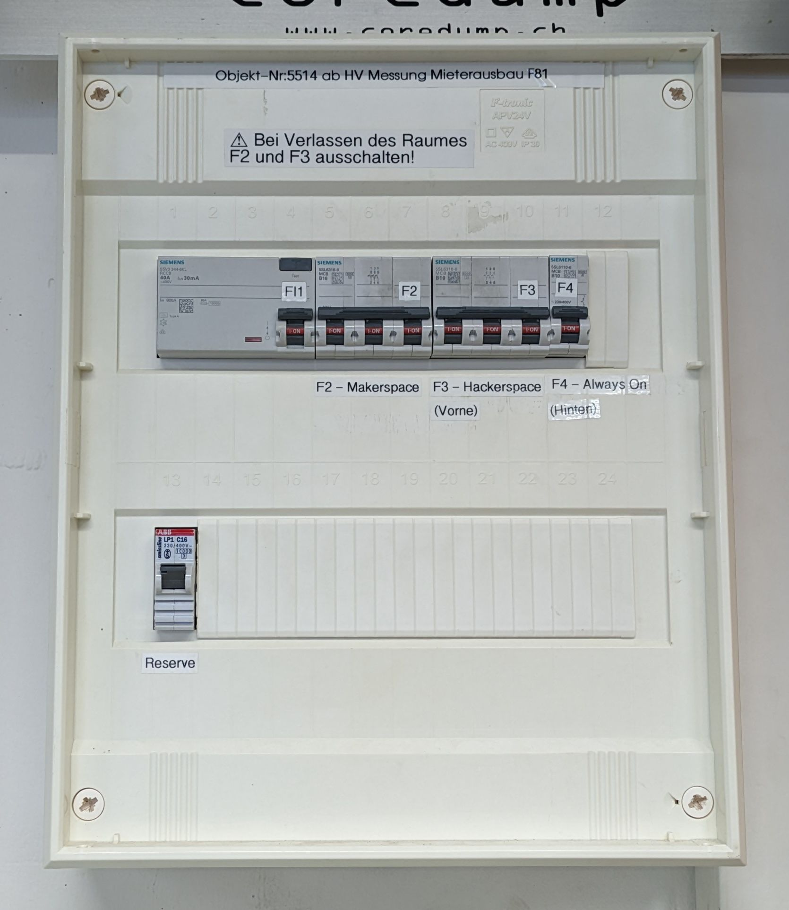

# Strom

```admonish info title="Wer kennt sich hier aus?"
Urban, Danilo
```

Um den Strom einzuschalten, musst du im Space rechts neben der Türe am
Sicherungskasten die zwei Schalter für „F2 Hackerspace“ und/oder „F3
Makerspace“ betätigen.



Bitte vor Verlassen des Raumes wieder ausschalten! Die „Always
On“-Sicherung sollte natürlich nie ausgeschaltet werden.
