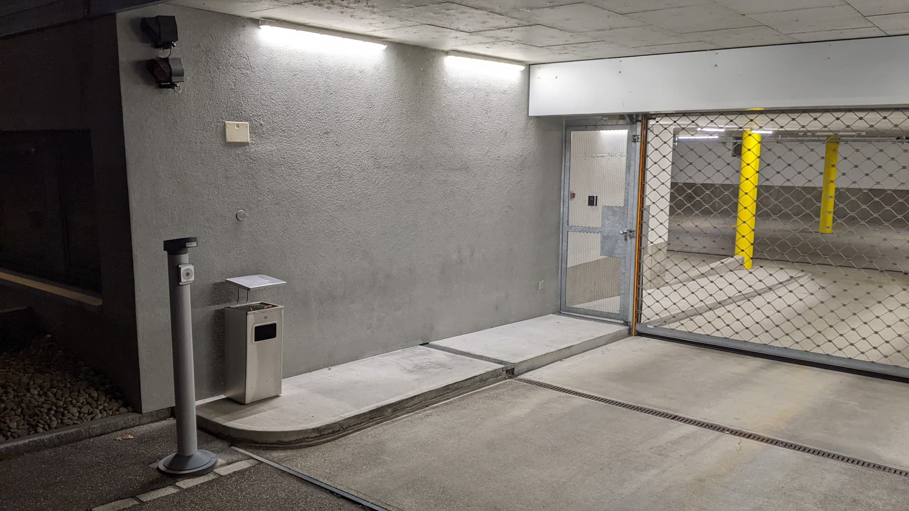
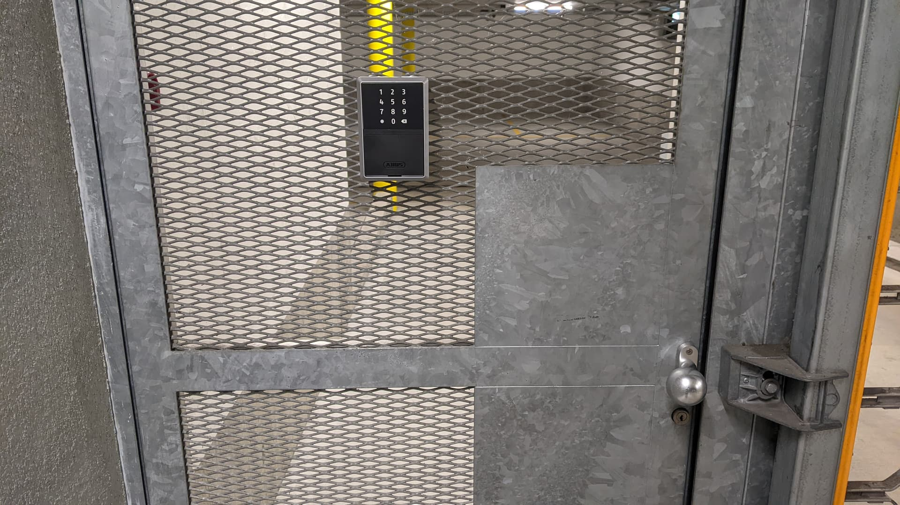
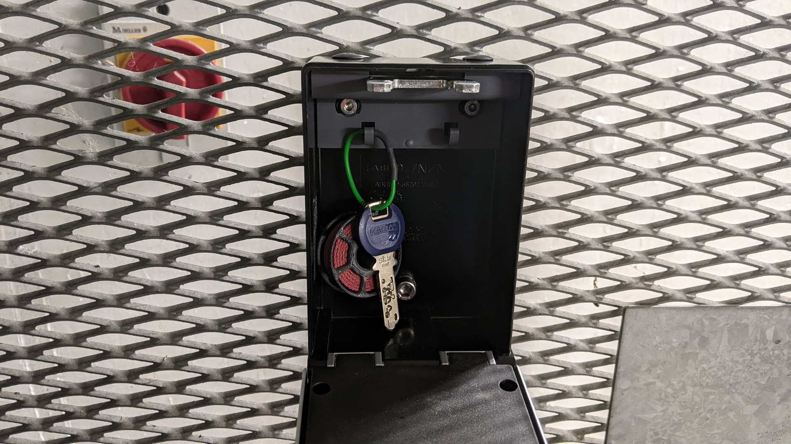

# Zugang

Als [Mitglied](../verein/mitgliedschaft.md) hast du jederzeit Zugang zu
unserem Hackerspace.

Ins Gebäude kommst du entweder von der Rückseite her durch das
Garagentor (zu Bürozeiten geöffnet) oder durch den Haupteingang an der
Eichwiesstrasse 4 (sollte meistens geöffnet sein). Wenn du durch den
Haupteingang kommst, musst du via Treppe oder Lift ins UG.

## Schlüssel / Schlüsselsafe

Leute, die regelmässig im Coredump sind, kriegen auf Wunsch einen
Schlüssel. Wir haben allerdings nur wenige Schlüssel, deshalb können wir
nicht versprechen, dass wir für dich einen übrig haben.

Es gibt aber an der Türe neben der Garageneinfahrt einen Schlüsselsafe:

Das Schloss kann entweder per App (ABUS HomeTec Pro,
[Android](https://play.google.com/store/apps/details?id=com.abus.hometecpro)
/ [iOS](https://apps.apple.com/de/app/abus-hometec-pro/id1516974702))
oder per PIN-Code entsperrt werden. Die App benötigt keinerlei
Cloud-Account oder Registrierung und funktioniert offline per Bluetooth.
Die Zugänge sind persönlich. Wenn du noch keinen Zugang hast, melde dich
bei Danilo.

Im Schlüsselsafe findet ihr den Schlüssel, der an der Aussen- und
Innentüre funktioniert:

